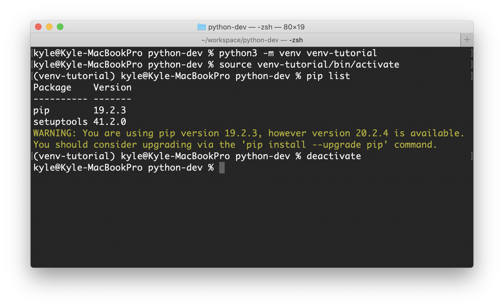

# Python 가상환경 - venv 

[본 포스팅은 파이썬 도큐먼트 [https://docs.python.org/ko/3/tutorial/venv.html](https://docs.python.org/ko/3/tutorial/venv.html)를 기반으로 작성되었습니다.]

# 가상환경이 필요한 이유

- 파이썬을 조금 써보면 알겠지만 그냥 순수 파이썬을 쓰기보다는 pandas, numpy, matplotlib 등 다양한 패키지를 import해서 사용한다.
- 보통 처음할 땐 로컬 환경에 pip(혹은 pip3) install {package_name}으로 설치해서 쓰는데 당장 눈앞에 보이는 프로젝트를 진행할 땐 문제가 없지만 여러 프로젝트를 동시에 진행하고 있거나 혹은 한 프로젝트 내에서 패키지 버전이 안 맞으면 문제가 발생한다.
- 예를 들어, 프로젝트 A는 django 버전 1.11을, 프로젝트 B는 django 버전 2.0을 사용한다고 해보자
- A를 진행하다가 B를 진행하면 버전 호환이 안 맞아 오류가 발생하므로 django 를 2.0으로 재설치후 진행하다가 다시 A를 하려면 2.0을 지우고 1.11을 재설치해야한다.
- 이러한 문제때문에 파이썬에서는 가상환경을 활용하여 개발을 하는데 대표적으론 venv와 conda가 있다. (conda랑 venv는 기능적 차이가 좀 있지만 파이썬 3.3부터 venv가 기본 내장되어있어서 나는 venv를 많이 쓴다.)

---

# venv 기본 사용법

- 가상환경이니 뭐니 해서 어려워보이지만 사용법은 별거 없다.

### 1. 가상환경 생성

- python 3.3 이상의 버전 부터는 venv 모듈을 내장하고 있으므로 따로 설치없이 가능하다.
- 터미널을 열어 자신이 개발하려는 workspace 폴더에 가서 아래 명령어를 입력하자.

```bash
python3 -m venv venv-tutorial
```

- venv-tutorial은 가상환경 이름이므로 자유롭게 쓰면 된다.
- 해당 구문을 실행하면 venv-tutorial 이름을 가진 가상 환경 폴더가 생성된다.

### 2. 가상환경 실행

- 생성을 했으면 해당 가상환경을 실행해야한다.
- 실행 소스 파일은 가상 환경 폴더 안의 bin폴더 안에 있다.

```bash
source venv-tutorial/bin/activate
```

- source 명령어를 통해 activate파일을 실행시켜 가상환경에 진입한다.
- terminal 앞쪽에 (venv-tutorial)같이 가상환경의 이름이 붙으면 진입에 성공한 것이다.
- pip list 명령어를 통해 설치된 패키지 버전들을 확인해보면 pip와 setuptools빼고는 아무것도 설치가 안된 깨끗한 상태임을 확인할 수 있다
- ***python3로 가상환경을 만들고 진입했으면 pip3 대신 pip명령어를 사용해도 된다.***

### 3. 가상환경 종료

- 가상환경을 종료하려면 deactivate 명령어를 사용하면 된다.

```bash
deactivate
```

- 터미널 앞에 가상환경 이름이 사라지면 정상적으로 종료된 것이다.

    

    ---

### 패키지 설치, 관리를 쉽게해보자 [pip freeze]

    - 가상 환경은 좋긴하지만 환경을 만들때마다 매번 호환되는 패키지를 버전대로 설치하는 것은 굉장히 귀찮은 일이다.
    - pip에선 설치된 패키지를 정리하고 설치하는 루틴을 제공하는데 아래와 같이 사용해보자
    - 먼저 위에 가상환경 설치 과정을 이용해서 envA와 envB 가상환경 2개를 만들어보자
    - envA에 설치된 패키지를 그대로 리스트업해서 envB에 옮기는 과정을 진행해보자
    - 가상환경 생성후 envA에 진입한다.

    ```bash
    python3 -m venv envA
    python3 -m venv envB
    source envA/bin/activate
    ```

    - 실험을 위해 matplotlib 패키지를 하나 설치한 후 리스트를 확인해보자

    ```bash
    pip install matlplitlib
    pip list
    ```

    

    - 위와 같은 패키지들이 설치되었는데 이 패키지들을 리스트업 해보자

    ```bash
    pip freeze > requirements.txt
    ```

    - 해당 명령어를 실행하면 실행한 위치에 requirements.txt가 생성된 것을 확인할 수 있다. (requirements.txt은 약간 국룰 파일명이다)

    

    - requirements.txt 안에 위와 같이 리스트업 된 것을 볼 수 있다.
    - 이제 envB 가상환경에 진입해서 해당 파일을 install 하면 리스트의 패키지를 모두 설치한다.

    ```bash
    pip install -r ./envA/requirements.txt
    ```

    [설치 완료된 모습]

    
